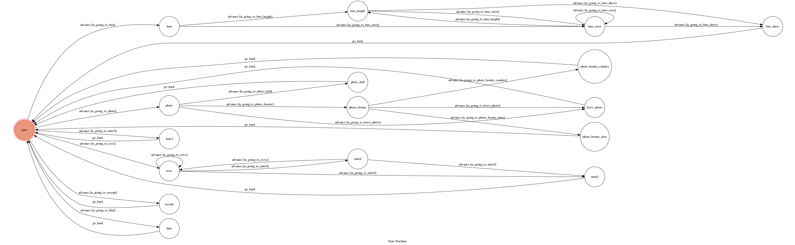

# TOC Final Project 2017

Code for TOC Final Project 2017

A telegram bot based on a finite state machine using python3


## Setup

### Prerequisite
* Python 3
* Telegram

#### Install Dependency
```sh
pip install -r requirements.txt
```

* pygraphviz (For visualizing Finite State Machine)
    * [Setup pygraphviz on Ubuntu](http://www.jianshu.com/p/a3da7ecc5303)

### Personal Data

`API_TOKEN` and `WEBHOOK_URL` in app.py **MUST** be set to proper values.
Otherwise, you might not be able to run your code.

### Run Locally
You can either setup https server or using `ngrok` as a proxy.

**`ngrok` would be used in the following instruction**

```sh
ngrok http 5000
```

After that, `ngrok` would generate a https URL.

You should set `WEBHOOK_URL` (in app.py) to `your-https-URL/hook`.

#### Run the Code

```sh
python3 app.py
```

## Finite State Machine


## Usage
初始STATE是 ***user*** ，有四種指令

* ***ooxx***
	* 使用 `inlinekeyboard` 做出OOXX的檯面讓使用者可以和 **BOT**對戰，輸入 `exit` 可以離開遊戲，遊戲中使用 `edit_message` 來更新遊戲檯面，遊戲結束後會詢問是否要繼續遊戲 `Y` or `N`，輸入 `Y` 開啟新遊戲，輸入 `N` 則回到起始STATE ***user***
<br><br>
* ***photo***
	* 進入後會出現三個選項，輸入數字即可進入相對應的STATE
		* ***(1)  Beauty*** &emsp;&emsp;&emsp;&emsp;&emsp;: &emsp;正妹圖
			* ***(1)  Candice***
			* ***(2)  Deer***
			* ***(3)  Leave photo***
		* ***(2)  通往地獄的大門*** &emsp;:&emsp;地獄梗圖
		* ***(3)  Leave photo***&emsp;&emsp;&emsp;:&emsp;離開 ***photo***
<br><br>
* ***bmi***
	* 首先會要求輸入 **體重(kg)**  ，再來要求輸入 **身高(cm)** ，最後會給出BMI值和兵役體位 ， 如果輸入的 **不是數字** 或是 **0** 的話會要求重新輸入
<br><br>
* ***3***
	* 單純只是為了測試是否有回到 ***user*** ，還有貼圖很可愛XD
	
<br><br>
* 其他輸入 
	* 會印出 ***HINT*** ， 告訴使用者有哪些指令是有效的
	
## Author
[ORay0919](https://github.com/ORay0919)

Template Code from [Lee-W](https://github.com/Lee-W/TOC-Project-2017)
